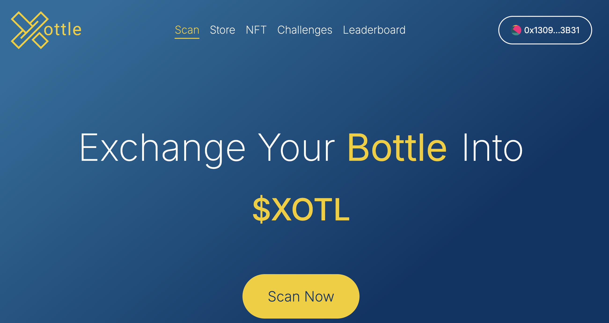
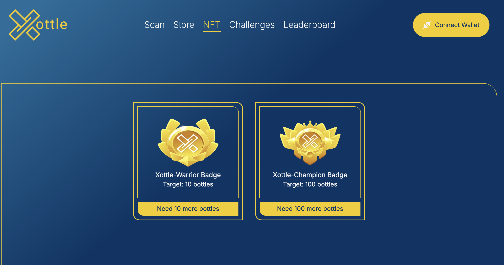

<h1 align="center"> Hi  , I'm <u>Najatul Muslim Dinatra</u> from Indonesia  ! </h1>

<h3 align="center"> Web3 Developer | Blockchain Engineer | Software Engineer | ETH SEA Hackathon 1st Place Winner </h3>

Passionate Web3 Developer and Blockchain Engineer with hands-on experience in developing decentralized applications (DApps) and smart contracts. I recently secured 1st place in the ETH SEA Hackathon, where I demonstrated my ability to build innovative blockchain solutions. My journey into Web3 is driven by a strong desire to contribute to the decentralized future, leveraging blockchain technology to create secure, scalable, and efficient systems.

In addition to my expertise in Web3, I bring over 3-5 years of experience as a Fullstack Software Engineer with a diverse skill set in JavaScript/TypeScript, ReactJS/React Native, Node.js, Golang, Laravel PHP, and WordPress. I have successfully contributed to the growth of education technology, software house, and insurance companies, consistently delivering high-quality solutions that meet business needs.

I am also well-versed in cloud infrastructure, including AWS and GCP, where I have deployed and managed scalable applications. My proficiency in Docker, Kubernetes, CI/CD pipelines, and unit testing allows me to maintain high code quality and streamline the development process across various environments.

I thrive in fast-paced, dynamic environments and am always eager to take on new challenges. My goal is to bring my technical prowess and comprehensive industry experience to drive impactful projects in the Web3 space, helping organizations innovate and grow in the decentralized world.

<h2> 🤝 Connect with me </h2> 
&nbsp;
&nbsp;

 
 

<h2> 🔥 What I'm working on </h2> 
&nbsp;

<h4>1st Place Winner ETH SEA Hackathon</h4>
<h3>Tokenized Bottle Waste (Xottle)</h3>

Xottle is a platform that combines financial incentives, gamification, and blockchain transparency to make recycling easier, more engaging, and rewarding. By transforming the way people perceive and participate in recycling, Xottle contributes to reducing plastic waste and promoting a more sustainable future. This solution is not just for individuals, but also for companies and organizations looking to enhance their sustainability initiatives.

👉 <a href="https://xottle.asia/"> Check it out</a> 👈
👉 <a href="https://devfolio.co/projects/tokenized-bottle-waste-xottle-ace9"> Check the devfolio project here</a> 👈

 
 
 

<h2> 📈 Github Stats </h2> 

<h2> 🛠️ Skills </h2> 
<h3> Smart Contract Development </h3> 
&nbsp;
&nbsp;
&nbsp;
&nbsp;
&nbsp;
&nbsp;
&nbsp;
&nbsp;

 

<h3> Programming Languages </h3> 
&nbsp;
&nbsp;
&nbsp;
&nbsp;
&nbsp;
&nbsp;
&nbsp;
&nbsp;
&nbsp;
&nbsp;

 

<h3> Database and Containerization </h3> 
&nbsp;
&nbsp;
&nbsp;
&nbsp;
&nbsp;
&nbsp;
&nbsp;

 

<h3> Library, Framework and CMS </h3> 
&nbsp;
&nbsp;
&nbsp;
&nbsp;
&nbsp;
&nbsp;
&nbsp;
&nbsp;

 

<h3> Cloud Services & Security </h3> 
&nbsp;
&nbsp;
&nbsp;
&nbsp;
&nbsp;
&nbsp;
&nbsp;

 

<h3> CSS Framework & Design </h3> 
&nbsp;
&nbsp;
&nbsp;
&nbsp;
